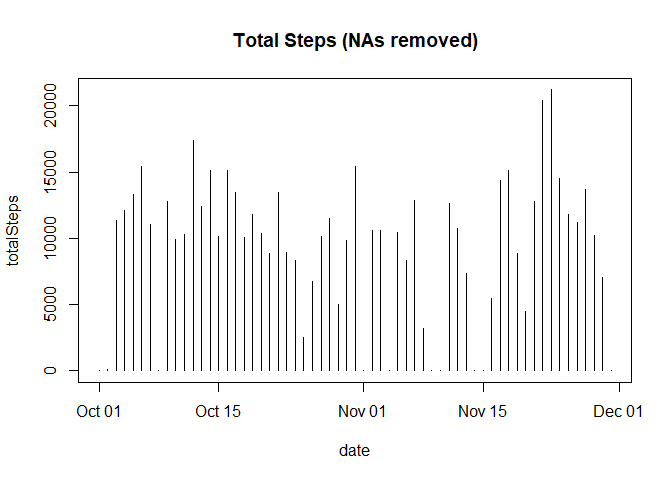
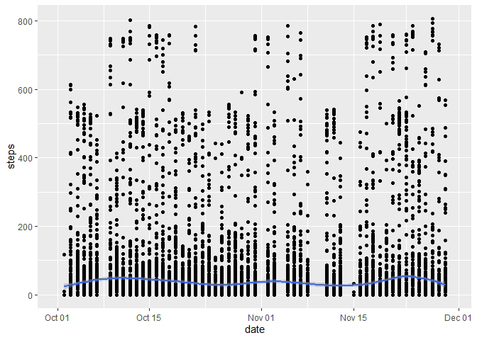
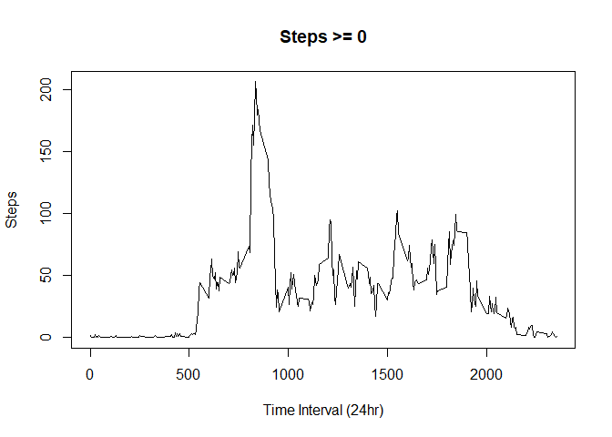
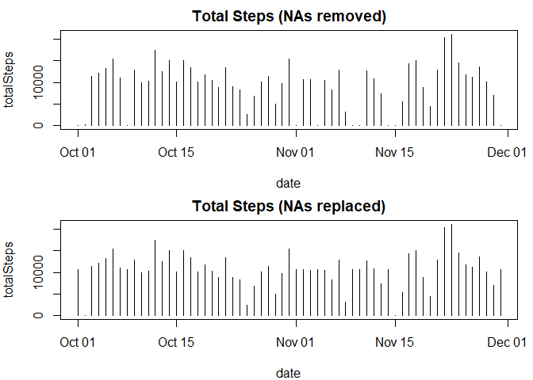
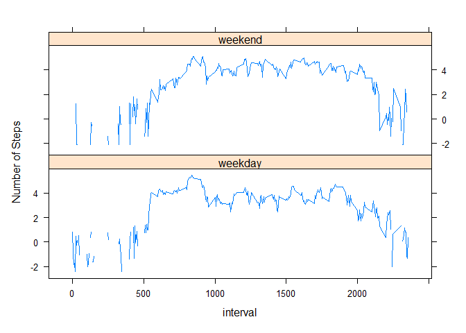

## Loading and preprocessing the data


```r
library(ggplot2)
library(dplyr)
```

```
## Warning: package 'dplyr' was built under R version 4.1.3
```

```
## 
## Attaching package: 'dplyr'
```

```
## The following objects are masked from 'package:stats':
## 
##     filter, lag
```

```
## The following objects are masked from 'package:base':
## 
##     intersect, setdiff, setequal, union
```

```r
library(lattice)
resetPar <- function() {
  dev.new()
  op <- par(no.readonly = TRUE)
  dev.off()
  op
}
if(!file.exists("./data")){dir.create("./data")}
if (!file.exists("./data/repdata_data_activity.zip")){
  file_url <- "https://d396qusza40orc.cloudfront.net/repdata%2Fdata%2Factivity.zip"
  download.file(file_url, "./data/repdata_data_activity.zip")
  rm(file_url)
}
setwd("./data")
if (!file.exists("activity.csv")) { 
  unzip("repdata_data_activity.zip") 
}

if(!exists("dfActivity")) {
  dfActivity <- read.csv("activity.csv")
  dfActivity$date <- as.Date(dfActivity$date, "%Y-%m-%d")
}

if(!exists("dfRemoveNA")) {
  dfRemoveNA <- dfActivity[!(is.na(dfActivity$steps)),]
  dfDate <- group_by(dfRemoveNA, date) 
  dfNoZero <- dfDate[dfRemoveNA$steps > 0, ]  
}
```

## What is mean total number of steps taken per day?


```r
plot(dfActivity %>% group_by(date) %>% summarise(totalSteps = sum(steps, na.rm = T)), type = "h",main = "Total Steps (NAs removed)")
```

<!-- -->

```r
ggplot(dfActivity, aes(date, steps)) + geom_point() + geom_smooth() 
```

```
## `geom_smooth()` using method = 'gam' and formula 'y ~ s(x, bs = "cs")'
```

```
## Warning: Removed 2304 rows containing non-finite values (stat_smooth).
```

```
## Warning: Removed 2304 rows containing missing values (geom_point).
```

<!-- -->

```r
summarise(dfNoZero, meanSteps = mean(steps, na.rm=T), medianSteps = median(steps, na.rm=T), totalSteps = sum(steps, na.rm=T))
```

```
## # A tibble: 53 x 4
##    date       meanSteps medianSteps totalSteps
##    <date>         <dbl>       <dbl>      <int>
##  1 2012-10-02      63          63          126
##  2 2012-10-03     140.         61        11352
##  3 2012-10-04     121.         56.5      12116
##  4 2012-10-05     155.         66        13294
##  5 2012-10-06     145.         67        15420
##  6 2012-10-07     102.         52.5      11015
##  7 2012-10-09     135.         48        12811
##  8 2012-10-10      95.2        56.5       9900
##  9 2012-10-11     137.         35        10304
## 10 2012-10-12     157.         46        17382
## # ... with 43 more rows
```

## What is the average daily activity pattern?

```r
dfIntervalMeanAll <- dfActivity %>% group_by(interval) %>% summarise(mean=mean(steps, na.rm = T))
plot(dfIntervalMeanAll, type = "l", main="Steps >= 0", xlab = "Time Interval (24hr)", ylab="Steps")
```

<!-- -->

### Most active time interval? 
#### 8:35 AM

```r
dfIntervalMeanAll[dfIntervalMeanAll$mean == max(dfIntervalMeanAll$mean),"interval"]
```

```
## # A tibble: 1 x 1
##   interval
##      <int>
## 1      835
```


## Imputing missing values
#### Number of missing values? 

```r
nrow(dfActivity[is.na(dfActivity$steps),])
```

```
## [1] 2304
```
#### Imput missing values... 

```r
dfReplaceNA <- merge(dfActivity, dfIntervalMeanAll, by = "interval")
#set newStep = Interval mean for NAs
dfReplaceNA[is.na(dfReplaceNA$steps),"newstep"] <- round(dfReplaceNA[is.na(dfReplaceNA$steps), "mean"])
dfReplaceNA[!is.na(dfReplaceNA$steps),"newstep"] <- round(dfReplaceNA[!is.na(dfReplaceNA$steps), "steps"])
dfReplaceNA$mean <- NULL
names(dfReplaceNA) <- c("interval", "oldSteps", "date", "steps")
head(dfReplaceNA[is.na(dfReplaceNA$oldSteps),])
```

```
##    interval oldSteps       date steps
## 1         0       NA 2012-10-01     2
## 11        0       NA 2012-11-04     2
## 32        0       NA 2012-11-30     2
## 41        0       NA 2012-11-14     2
## 45        0       NA 2012-11-09     2
## 49        0       NA 2012-11-01     2
```

```r
par(mfrow = c(2, 1), mar = c(4, 4, 2, 1))
plot(dfActivity %>% group_by(date) %>% summarise(totalSteps = sum(steps, na.rm = T)), type = "h",main = "Total Steps (NAs removed)")
plot(dfReplaceNA %>% group_by(date) %>% summarise(totalSteps = sum(steps, na.rm = T)), type = "h",main = "Total Steps (NAs replaced)")
```

<!-- -->

```r
par(resetPar())
```
## Are there differences in activity patterns between weekdays and weekends?
#### Answer: Not really

```r
dfReplaceNA$DOW <- weekdays(dfReplaceNA$date)
weekend <- dfReplaceNA$DOW %in% c("Saturday","Sunday")
dfReplaceNA[weekend,"day"] <- "weekend"
dfReplaceNA[!weekend,"day"] <- "weekday"
head(dfReplaceNA)
```

```
##   interval oldSteps       date steps      DOW     day
## 1        0       NA 2012-10-01     2   Monday weekday
## 2        0        0 2012-11-23     0   Friday weekday
## 3        0        0 2012-10-28     0   Sunday weekend
## 4        0        0 2012-11-06     0  Tuesday weekday
## 5        0        0 2012-11-24     0 Saturday weekend
## 6        0        0 2012-11-15     0 Thursday weekday
```

```r
df2 <- dfReplaceNA %>% group_by(interval, day) %>% summarise(mean=mean(steps))
```

```
## `summarise()` has grouped output by 'interval'. You can override using the
## `.groups` argument.
```

```r
xyplot(log(mean)~interval|day, data=df2, type="l", layout=c(1,2), ylab = "Number of Steps")
```

<!-- -->


